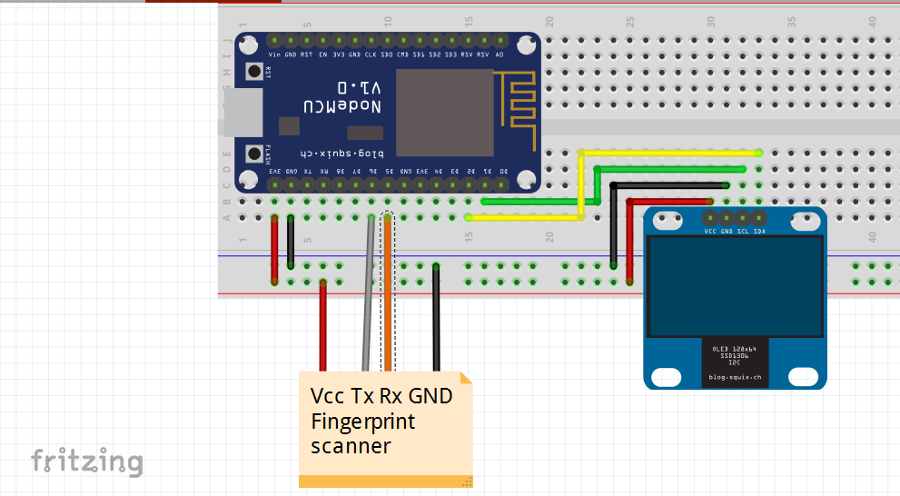

# Biometric Attendance System

This project is a biometric attendance system that utilizes the R307 fingerprint sensor and ESP8266 NodeMCU to register and track attendance using fingerprints. The system includes a web-based interface powered by XAMPP, allowing administrators to manage attendance records easily.

## Table of Contents

- [Installation](#installation)
- [Usage](#usage)
- [Features](#features)
- [Configuration](#configuration)
- [Documentation](#documentation)
- [Acknowledgments](#acknowledgments)
- [Contributing](#contributing)
- [License](#license)
- [Contact](#contact)

## Installation

1. Clone or Download the repository to your local machine using the following command:
```
git clone https://github.com/kershrita/Biometric-Attendance-System.git
```
To get started with the biometric attendance system, follow the steps below:

2. Assemble & Components
	- Assemble according to this circuit diagram:



	- Components:
		- 1 * ESP8266 NodeMCU
		- 1 * R307 Fingerprint Sensor
		- 1 * OLED Graphic Display 128x64 Serial I2C 0.96 inch

3. Install XAMPP

	- Download and install [XAMPP](https://www.apachefriends.org/download.html), a cross-platform web server solution package.
	- After installing XAMPP, activate the Apache and MySQL servers.

4. Set up the Web Application

	- Locate the "biometricattendance" folder and place it in the following path: C:\xampp\htdocs.
	- This folder contains the necessary files for the web-based interface.

5. Configure Wi-Fi Settings

	- Open the Wi-Fi settings on your server[PC/laptop].
	- Select "Internet Protocol Version 4" and activate the Static IP option.
	- Set the IP address of your server to match your router's IP.

6. Update IP and Wi-Fi Settings in Arduino Code

	- Open the Arduino code for the ESP8266 NodeMCU.
	- Update the IP address in the code with the IP address of your laptop or computer.
	- If you want to change the network settings, modify the Wi-Fi network name and password in the code.

7. Install Required Libraries and Boards

	- Install the libraries provided in the Arduino IDE. These libraries are required for uploading the code to the ESP8266 NodeMCU.
	- Make sure that the ESP8266 boards are available in the Arduino IDE.

**Note**: you can find neccassry libraries [here](Libraries).

8. Upload the Code to ESP8266 NodeMCU

	- Connect the ESP8266 NodeMCU to your computer using a USB cable.
	- Choose the correct port for the device in the Arduino IDE.
	- Upload the code to the ESP8266 NodeMCU.

9. Install and Set Up the Server

	- Open a web browser and enter the IP address of your laptop or computer.
	- Follow the instructions displayed in the browser to set up the server.
	- Create the necessary database for storing attendance records.

## Usage

1. Once the database is created, you can start adding and deleting people's fingerprints and monitor their attendance and departure.
2. Open the following link in your web browser: http://192.168.29.200/biometricattendance/index.php

**Note**: this IP is my own you can modify it according to your needs and if you need a step by step guidence with images you will find it **[here](Getting%20Started.pdf)**.

## Features

- **Real-time Attendance Tracking**: The system tracks attendance in real time, allowing for accurate monitoring of people entering or leaving the seating area.
- **Fingerprint Authentication**: Users can register their fingerprints using the R307 fingerprint sensor. The system verifies fingerprints for attendance tracking, ensuring secure and reliable identification.
- **Web-Based Interface**: The system includes a web-based interface powered by XAMPP, providing an easy-to-use platform for managing attendance records. Administrators can add and delete fingerprints, view attendance logs, and generate reports.
- **Visual and Audible Notifications**: LED lights and a buzzer provide clear visual and audible notifications when a seat becomes available or occupied, ensuring that users are aware of seating status changes.
- **Database Integration**: Attendance records are stored in a MySQL database, enabling efficient management and retrieval of attendance data. Administrators can access and analyze attendance records for reporting purposes.
- **Flexible Wi-Fi Configuration**: The system allows for easy configuration of Wi-Fi settings, enabling seamless integration into existing network environments. Administrators can specify the Wi-Fi network name and password in the code.
- **Easy Installation and Setup**: The project provides step-by-step instructions for installation and setup, ensuring a smooth setup process for users.
- **Open-Source and Customizable**: The project is open-source, allowing users to modify and enhance the system according to their specific requirements. The code is provided for further customization and expansion.

## Configurations

The biometric attendance system offers several uses and applications across various domains:

- **Educational Institutions**: The system can be utilized in schools, colleges, and universities to automate attendance tracking for students and faculty members. It provides an efficient and reliable method of attendance management, eliminating the need for manual processes.
- **Corporate Offices**: Biometric attendance systems are widely used in corporate offices to streamline attendance recording for employees. It ensures accurate tracking of work hours, simplifies payroll processing, and reduces the chances of buddy punching or time theft.
- **Government Organizations**: Government offices and agencies can benefit from the biometric attendance system to monitor attendance of employees and ensure punctuality. It helps in maintaining accurate records and enhances transparency in attendance management.
- **Healthcare Facilities**: Hospitals, clinics, and healthcare facilities can utilize the system to track the attendance of healthcare professionals, staff members, and patients. It enables efficient scheduling and improves overall workflow management.
- **Gyms and Fitness Centers**: Biometric attendance systems can be implemented in gyms and fitness centers to manage member attendance and access control. It ensures only authorized individuals can access the facilities and tracks their attendance for billing and monitoring purposes.
- **Events and Conferences**: During events and conferences, the system can be used to manage attendee registration and track their presence at different sessions. It provides organizers with accurate attendance data and helps in ensuring efficient event management.
- **Co-working Spaces**: Co-working spaces can implement the biometric attendance system to monitor the usage of shared spaces and track the attendance of members. It enables efficient utilization of resources and provides transparent billing based on actual usage.
- **Research Laboratories**: Research institutions and laboratories can benefit from the system to track the presence of researchers, assistants, and other staff members. It ensures compliance with safety protocols and maintains records of laboratory access.
- **Manufacturing and Industrial Facilities**: Biometric attendance systems can be utilized in manufacturing and industrial settings to monitor employee attendance and manage shift schedules. It helps in maintaining a record of work hours and ensures appropriate staffing levels.
- **Security Access Control**: The system can also be integrated with access control systems to provide secure entry and exit for authorized individuals. It enhances overall security by restricting access to designated areas based on fingerprint authentication.

## Acknowledgments


We would like to acknowledge the following resources and libraries that have been instrumental in developing Kids Learning Program:

- **[Arduino IDE](https://www.arduino.cc/en/software)**:  An open-source integrated development environment (IDE) used for programming Arduino boards.
- **[XAMPP](https://www.apachefriends.org/download.html)**: An open-source software package that provides a complete web development environment. It includes Apache, MySQL, PHP, and Perl, making it easy to set up and configure a local web server for development and testing purposes. XAMPP simplifies the process of creating dynamic web applications and allows you to work on projects offline before deploying them to a production server.
- **[Adafruit GFX Library](Libraries/Adafruit-GFX-Library-master.zip)**: The Adafruit GFX Library is a graphics library developed by Adafruit Industries. It provides a set of functions and utilities for drawing shapes, text, and images on various display devices, including LCDs, OLEDs, and TFT screens
- **[Adafruit Fingerprint Sensor Library](Libraries/Adafruit-Fingerprint-Sensor-Library-master.zip)**: The Adafruit Fingerprint Sensor Library is a library specifically designed for interfacing with fingerprint sensors manufactured by Adafruit. This library simplifies the process of capturing and processing fingerprint data, enabling secure fingerprint authentication and identification in Arduino or microcontroller-based projects
- **[Adafruit SSD1306](Libraries/Adafruit_SSD1306-master.zip)**: The Adafruit SSD1306 library is another library developed by Adafruit Industries. It is designed for controlling SSD1306-based OLED displays, which are small monochrome screens with high contrast and low power consumption.

## Contributing

Thank you for considering contributing to the Biometric Attendance System! We welcome any contributions that can enhance the program and make it even better.

## License

Biometric Attendance System is released under the [MIT License](LICENSE).

## Contact

- Mail: ashrafabdulkhaliq80@gmail.com
- LinkedIn: https://www.linkedin.com/in/ashraf-abdulkhaliq
- GitHub: https://github.com/kershrita